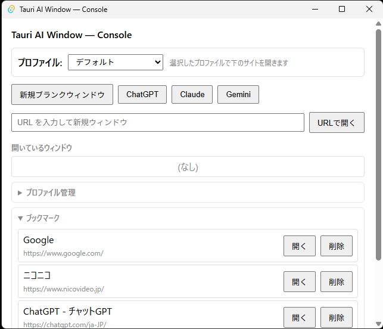
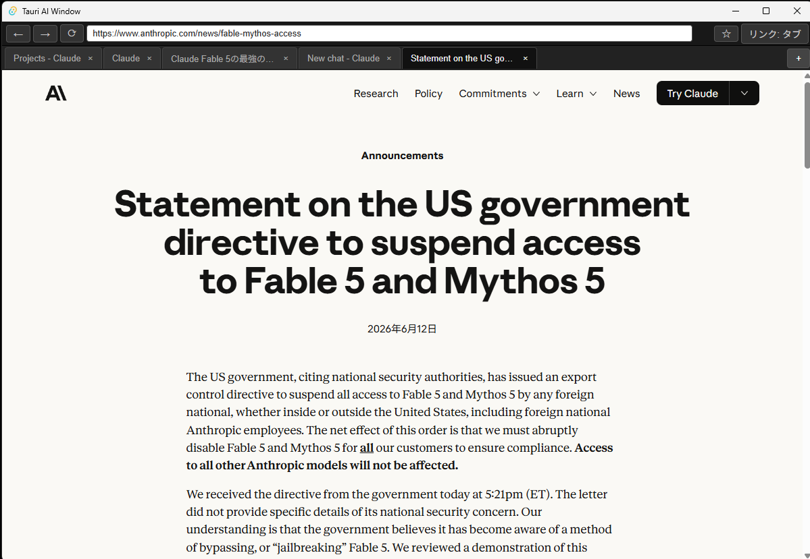
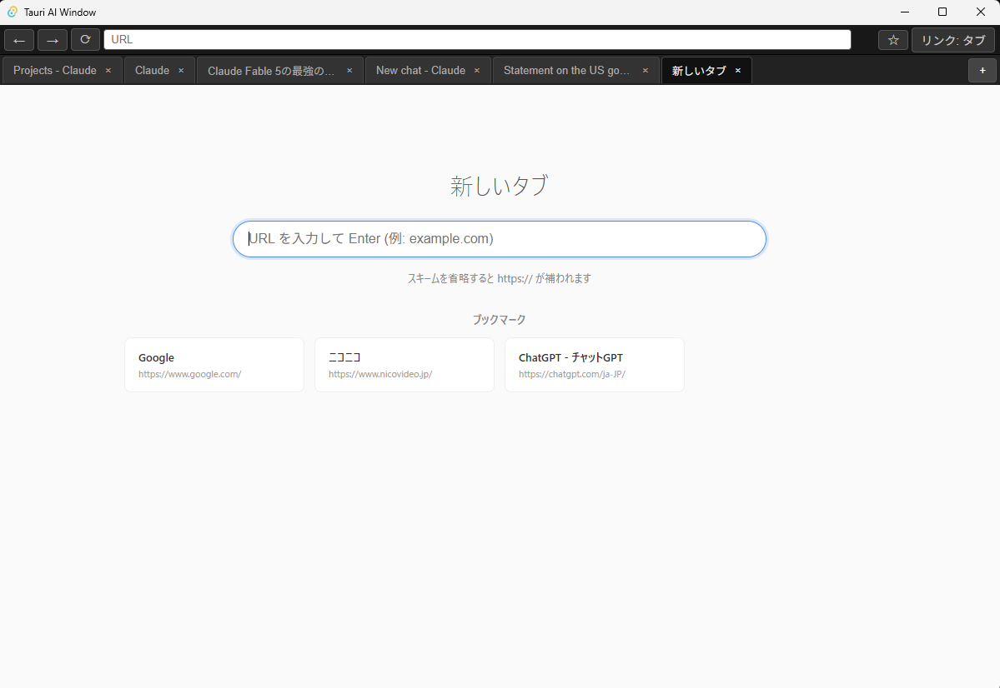

# Tauri AI Window

複数の AI チャットサービス（ChatGPT / Claude / Gemini など）を、タブとウィンドウで並行利用するための軽量なデスクトップアプリです。Tauri 2 + WebView2（Windows 専用）で構築しています。

セッション・プロファイル・ブックマーク・履歴・ダウンロードを、軽量な「コンソール」ウィンドウからまとめて管理できます。

> **Status:** 開発中（プロトタイプ）。この README はたたき台であり、公開リリース向けに今後加筆・整理する予定です。

---

## 特徴

- **コンソールウィンドウ** — ブラウザウィンドウの起動・管理を行う管制塔。閉じるとアプリ全体が終了します
- **マルチウィンドウ / マルチタブ** — 1 タブ = 1 つの WebView2 インスタンス
- **アドレスバー・戻る/進む・リロード・タブクローズ**
- **リンクの開き分け** — タブ / ウィンドウのモード切替、修飾キー（Ctrl/Shift+Click）・中ボタン・`target=_blank` に対応
- **ブックマーク** — 一覧表示とタブバーからのトグル（☆）
- **ローカル履歴** — 閲覧履歴の記録と一覧
- **ダウンロード追跡** — アプリ管理フォルダへ自動保存し、完了後にファイル/フォルダを開く操作を提供
- **プロファイル管理** — WebView2 のユーザーデータフォルダをプロファイル単位で分離（Cookie / localStorage を分離）
- **非アクティブタブの休止（省リソース）** — タブモードで非アクティブになった content タブを非表示にして `TrySuspend` で休止し、メモリ・CPU を抑制。アクティブ化時に `Resume` して再表示します
  - ログイン状態はプロファイルの Cookie 等に保存されるため、休止しても維持されます
  - 補助的に `MemoryUsageTargetLevel` も併用（いずれもベストエフォート）
  - 制約: メディア再生中のタブを休止すると再生が止まります（後述の「仕様・制約」参照）

---

## スクリーンショット

### コンソール（管制塔）ウィンドウ

ブラウザウィンドウの起動・管理、ブックマーク／履歴／ダウンロード／プロファイルをまとめて操作します。



### ブラウザウィンドウ（マルチタブ）

1 タブ = 1 つの WebView2。アドレスバー・戻る/進む・リロード・リンク開きモード切替を備えます。



### 新規タブ

ブックマークをグリッド表示し、URL を入力して遷移できます。



---

## 必要環境

- Windows
- WebView2 ランタイム
- Rust ツールチェーン
- Tauri 2 のツールチェーン要件

本プロジェクトは Windows / WebView2 を前提に設計されています。WebView2 固有の挙動については macOS / Linux は現時点で対象外です。

---

## リポジトリ構成

```text
.
├─ ui/                 # 静的な HTML/CSS/JS による UI
│  ├─ console.*        # コンソール（管制塔）ウィンドウ
│  ├─ tabbar.*         # 各ブラウザウィンドウ上部のタブバー
│  └─ newtab.*         # 新規タブ（ローカルページ）
└─ src-tauri/          # Tauri / Rust アプリケーション
   ├─ src/
   │  ├─ commands/     # IPC コマンド（window/tab/navigation/link/bookmark/history/profile/download）
   │  ├─ inject/       # content webview に注入する JS
   │  ├─ state.rs          # アプリ状態（ウィンドウ・タブ・ダウンロード）
   │  ├─ webview_mem.rs     # MemoryUsageTargetLevel の切替
   │  └─ webview_suspend.rs # 非アクティブタブの TrySuspend / Resume
   └─ tauri.conf.json
```

---

## 開発

リポジトリルートから:

```powershell
cd src-tauri
cargo build
```

主なチェック:

```powershell
cargo test
cargo clippy
cargo tree -i webview2-com
cargo tree -i windows
```

想定している依存バージョン:

- `webview2-com 0.38.2`
- `windows 0.61.3`
- Tauri は `Cargo.lock` 経由で `tauri 2.11.2` に解決

---

## アーキテクチャ概要

アプリは 3 種類の WebView で構成されます。

| 種類 | ラベル例 | 役割 |
|------|----------|------|
| コンソール | `console` | アプリの起点。ブラウザウィンドウの管理。閉じると全終了 |
| タブバー | `bw_a-tabbar` | 各ブラウザウィンドウ上部の操作 UI |
| コンテンツ | `bw_a-tab-a` | 外部サイトを表示する実体（1 タブ = 1 WebView2） |

非アクティブになった content タブは、`Controller.IsVisible = false` にしたうえで `ICoreWebView2_3::TrySuspend` で休止します（JS 実行を止め、メモリを解放）。再びアクティブになると `Resume` して再表示します（`src-tauri/src/webview_suspend.rs`）。あわせて `ICoreWebView2_19::SetMemoryUsageTargetLevel` も併用します（`src-tauri/src/webview_mem.rs`）。いずれも完全ベストエフォートで、COM 呼び出しは UI スレッド上で実行し、ランタイム未対応や COM 失敗時でもタブ操作は止めません。ログインセッションはタブの休止と独立して、プロファイルの Cookie に保持されます。

### セキュリティ方針

リモートページを直接読み込む性質上、多層で防御しています。

- content webview には Tauri の `core:default` 権限を付与しない（リモートページへの API 漏洩防止）
- IPC 入口で呼び出し元 webview ラベルを glob 検証（capability の設定ミスへの二重防御）
- content 向けコマンドは tab 単位の nonce を要求し、外部ページからの直接 invoke を遮断
- 開ける URL は `http` / `https` に限定

---

## ドキュメント

設計に関する日本語ドキュメントはワークスペースの `DOC/` ディレクトリに置いています。リポジトリを単独で公開する場合は、必要に応じてこれらを `DOC/` として取り込むことを検討してください。

---

## 仕様・制約

### Google Keep は対象外（仕様）

`https://keep.google.com` は本アプリではサポート対象外で、本文が描画されず空白になります。これは下記の基盤側の仕様によるもので、現状の制約として扱っています。ChatGPT・Claude・Gemini などの AI チャットサービスは正常に利用できます。

- **理由:** wry は `window.ipc` を `Object.freeze` かつ再定義・書き換え不可（non-configurable / non-writable）で注入します。このため `ipc` という名前のグローバル変数を使う Google Keep のバンドルがそのオブジェクトと衝突し、本文が描画されません。wry / Tauri ベースの WebView2 アプリ全般に共通する名前衝突の挙動です。
- **アプリ側の扱い:** 当該プロパティは non-configurable のため、ページ側からもアプリの初期化スクリプトからも変更できません。アプリ層では対処できない基盤側の仕様であり、解消には wry 本体側の対応（注入プロパティの `configurable: true` / `writable: true` 化、またはチャネルの名前空間化）が前提となります。
- **参考:** 詳細は `DOC/GoogleKeep表示不具合レポート_window-ipc衝突.md`（wry へのアップストリーム報告用にまとめたもの）を参照してください。

### メディア再生サイト（YouTube 等）はタブモードでは再生が止まる（制約）

省リソースのため、**タブモードで非アクティブになったタブは休止（suspend）** します。そのため、**音声・動画を再生するサイト（YouTube など）を別タブに切り替えて非アクティブにすると、再生が止まります**（休止＝JS 実行停止のため）。タブに戻れば再開できますが、バックグラウンド再生はできません。

- **AI チャット（ChatGPT / Claude / Gemini など）は問題ありません。** 状態の多くがサーバー側にあり、テキスト主体で、ログインも Cookie で維持されるため、休止・復帰の影響をほぼ受けません。
- **回避策:** 再生を止めたくないサイトは、タブではなく **別ウィンドウ** で開いてください。ウィンドウ単位では常にアクティブ扱いとなり、休止されません。
- 将来的には「再生中・通信中は休止しない」といった判定を入れる余地があります（下記ロードマップ参照）。

## ロードマップ（案）

- 再生中・通信中タブの休止除外（メディア等の自動判定）
- 背景タブの遅延 webview 生成
- タブの discard / restore（長時間アイドル時の完全破棄と復元）
- ブラウザ引数の追加実験
- UI の仕上げとパッケージングフロー

---

## ライセンス

未定（TBD）。
